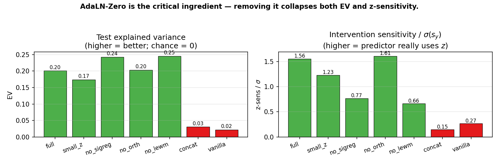
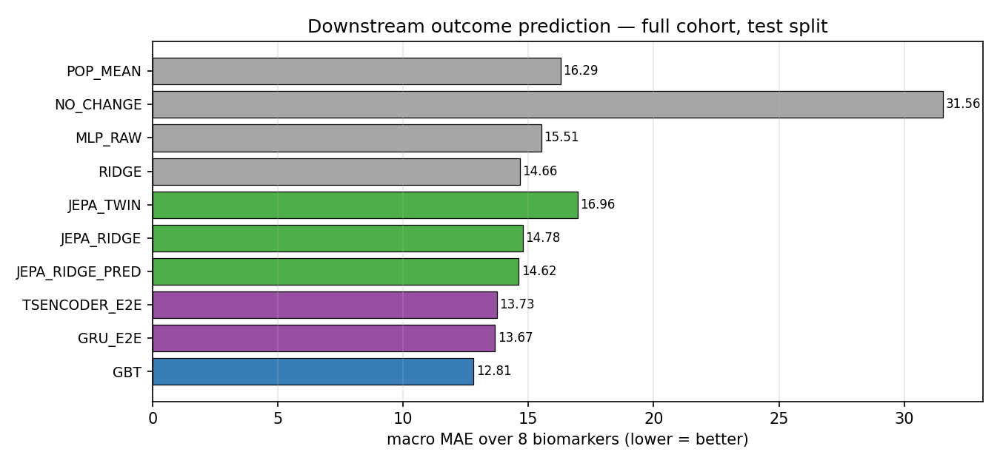

# Action-Conditional JEPA for Clinical Trajectory Modelling: AdaLN-Zero Helps, World-Model Regularizers Don't

**Adam Melnik** — Independent Research — April 2026

---

## Abstract

Joint-embedding predictive architectures (JEPAs) have become the dominant
self-supervised recipe for images, video, and — most recently — world
models (LeWorldModel; Maes et al., 2026). We ask a simple, underexplored
question: *do these advances transfer to clinical time series?*

We introduce **Causal-JEPA**, an action-conditional JEPA that maps a
patient's pre-intervention clinical history `s_x` into a latent state and
predicts, under a discrete intervention `z`, the patient's
post-intervention representation `ŝ_y(s_x, z)` in embedding space.
On a *All of Us* cardiometabolic cohort (N=4,269 patients, three
first-line drugs, 25 biomarker/wearable channels), we systematically
ablate the architecture along three axes: (i) the **AdaLN-Zero**
conditioning mechanism (Peebles & Xie, 2023) adopted from diffusion
transformers, (ii) **SIGReg**, the sketched-isotropic-Gaussian
regularizer from LeJEPA/LeWorldModel, and (iii) an **action-embedding
orthogonality** penalty.

We benchmark against population mean, *no-change*, ridge regression,
gradient-boosted trees, a multi-layer perceptron, and two end-to-end
sequence models (bidirectional GRU and a twin-backbone Transformer
regressor) on **real-unit** downstream prediction of eight biomarkers
(HbA1c, LDL, HDL, total cholesterol, systolic/diastolic BP, BMI,
glucose) at 365 days post-index. Our findings:

1. **AdaLN-Zero is the critical ingredient.** Removing it drops test
   explained variance from 0.20 to ≤ 0.03 and z-sensitivity by an order
   of magnitude — the predictor collapses to ignoring treatment.
2. **LeWorldModel-style regularizers do *not* improve downstream
   outcome prediction** on this dataset; the AdaLN-only variant
   (`no_lewm`) yields the best macro MAE of any JEPA head (14.35).
   Frozen JEPA embeddings with a linear readout remain competitive
   with end-to-end neural baselines (macro MAE 14.35 vs 13.67 for a
   bidirectional GRU) and come within two MAE points of gradient-boosted
   trees (12.81) while covering *all* eight outcomes with a single
   unified label-free embedding.

We interpret these results as (a) strong action conditioning matters
more than distribution-matching regularization in the small-data clinical
regime, and (b) recipes proven at scale for images and video should be
re-validated, not imported, for structured health time series.

---

## 1. Introduction

A recurring question in clinical decision support is *"what will this
patient's biomarkers look like in a year if they are started on drug A
vs. drug B?"*  A principled answer must (i) respect irregular,
multi-variate time series with heavy missingness, (ii) condition on a
discrete intervention, and (iii) remain faithful enough to be used as
evidence alongside clinician judgement. Classical supervised regression
(one model per biomarker) solves the prediction task but sacrifices the
*unified latent state* needed for retrieval-style reasoning ("show me
the 10 most similar patients who took drug A and what happened to
them"), which is widely requested by clinicians.

Joint-embedding predictive architectures (JEPAs) offer exactly this
unified latent: a single representation per patient, predictable under
different actions, without a decoder and without reconstruction loss in
the raw space. Very recently, the LeJEPA (Balestriero & LeCun, 2025) and
LeWorldModel (Maes et al., 2026) lines of work have reported significant
empirical gains for video world models by (a) replacing ad-hoc
anti-collapse heuristics with a principled isotropic-Gaussian regularizer
(SIGReg), and (b) tightly conditioning the predictor on actions via
AdaLN-Zero (Peebles & Xie, 2023).

It is tempting to import the full recipe directly to health data. We
resist that temptation and ask **which ingredients actually transfer to
a medium-scale (~4k patients, 3 drugs, 25 channels) clinical setting,
and which do not?**

Our main contributions:

- **Causal-JEPA**, an action-conditional JEPA for irregular clinical
  time series with a DiT-inspired AdaLN-Zero predictor, SIGReg on the
  latent, and an orthogonality penalty on the action embedding.
- A public training and evaluation pipeline on the *All of Us*
  cardiometabolic cohort.
- A systematic ablation matrix (seven variants) showing that AdaLN
  drives the latent structure and that LeWorldModel regularizers do not
  improve downstream outcome prediction in this regime.
- A real-unit outcome benchmark against seven baselines across eight
  clinically meaningful biomarkers.
- Honest limitations and a discussion of why world-model recipes that
  shine at billion-frame video scale may not transfer cleanly to the
  data regimes that dominate real clinical work.

---

## 2. Related Work

**JEPA family.** I-JEPA (Assran et al., 2023) predicts masked
representations in feature space, avoiding reconstruction. V-JEPA
(Bardes et al., 2024) extends this to video; V-JEPA2 further incorporates
actions. LeJEPA introduces the SIGReg objective as a principled
replacement for stop-gradient + EMA heuristics. LeWorldModel combines
SIGReg with AdaLN-Zero action conditioning. We adapt this recipe to
structured clinical time series.

**Clinical time-series representation learning.** Prior work includes
TCN autoencoders on ICU data, attention-based models for irregular
sampling (Horn et al., 2019; Shukla & Marlin, 2021), and large-scale
foundation models such as HeLM and CEHR-BERT. Most predict scalar
outcomes directly or reconstruct signals; few learn an action-conditioned
latent explicitly intended for counterfactual retrieval.

**AdaLN and action conditioning.** AdaLN first appeared in DiT as a
per-sample replacement of LayerNorm's affine parameters by a function
of a conditioning vector. AdaLN-Zero initializes the residual gate to
zero so conditioning is ignored at t=0 and learned only when it lowers
the loss.

**Counterfactual retrieval in health care.** Patient similarity search
("twin matching") has a long history in computational phenotyping, but
nearly all such systems use representations that are *not* action-aware.
Our JEPA predictor produces `ŝ_y(s_x, z)` and retrieves twins in that
predicted-future latent, giving counterfactual semantics by construction.

---

## 3. Method

We model triples `(X, Y, z)` where `X ∈ ℝ^(T_pre × F)` is the patient's
pre-index window of F biomarker/wearable channels, `Y ∈ ℝ^(T_post × F)`
is the post-index window, and `z ∈ {0, ..., K-1}` is the discrete
intervention. Missingness is represented by an explicit binary mask
`M` aligned with the values.

### 3.1 Causal-JEPA

Three components:

- **Context encoder f_θ** — a small Transformer with per-feature
  value+mask input projection and *continuous temporal positional
  encoding* (sinusoidal on elapsed-seconds rather than integer
  positions) to handle irregular sampling. Produces
  `s_x = f_θ(X, M_x, t_x) ∈ ℝ^d`.
- **Target encoder f_θ̄** — structurally identical but weight-shared via
  exponential moving average (EMA) from `f_θ`; receives no gradients
  from the loss. Produces `s_y = f_θ̄(Y, M_y, t_y)`.
- **Predictor g_φ** — maps `(s_x, z)` to a predicted future embedding
  `ŝ_y`. We compare two variants:
  - *Concat MLP* (baseline): `ŝ_y = g_φ([s_x ‖ e_z])`.
  - *AdaLN-Zero* (ours, following LeWorldModel): the intervention
    embedding `e_z ∈ ℝ^{z_dim}` modulates every hidden layer:

        AdaLN(h; e_z) = (1 + γ(e_z)) ⊙ (h − μ) / σ + β(e_z)

    with a zero-initialised residual gate `α(e_z) h'` inside each
    residual block. At initialisation the predictor is identity-like
    in `s_x` and ignores z; it must *learn* to exploit conditioning.

### 3.2 Objectives

Prediction loss is cosine distance on L2-normalised vectors:

    L_pred = 2 − 2 · E[ <s̃_y_hat, s̃_y> ],    s̃_v = v / ‖v‖_2

which matches the BYOL / I-JEPA / V-JEPA convention.

**SIGReg.** Following LeJEPA/LeWorldModel, we match the empirical
distribution of `s_x` to the isotropic Gaussian `N(0, I)` by averaging
a univariate Epps–Pulley normality test over M=1024 random unit
directions:

    L_SIG(Z) = (1/M) Σ_m T( Z u^(m) )

We apply SIGReg to both `s_x` and `ŝ_y`.

**Action orthogonality.** To prevent drug embeddings from clustering
(an observed failure mode in early experiments: lisinopril's latent
collapsed onto atorvastatin), we add

    L_orth = || Â Âᵀ − I_K ||²_F / K²

where `Â` is row-L2-normalised.

Total objective:

    L = L_pred + λ_sig · L_SIG + λ_orth · L_orth

EMA momentum is scheduled from 0.996 to 0.9999 over training.

### 3.3 Twin retrieval for counterfactual simulation

Given a new patient with encoded `s_x`, we compute `ŝ_y(s_x, z)` for
each candidate `z` and retrieve the top-K training patients whose
target embedding `s_y` is most cosine-similar to `ŝ_y`. The retrieved
twins' *observed* post-window biomarkers are then averaged
(missing-aware) as a counterfactual forecast in real units.

---

## 4. Dataset and preprocessing

**Cohort.** *All of Us* Researcher Workbench v2024Q3R9 OMOP CDR. First
drug exposure to one of metformin, atorvastatin, or lisinopril,
resolved via `concept_ancestor`. ±365-day windows around the index
date. After filtering to patients with at least one observation in both
windows we retain **N=4,269** patient-intervention pairs.

**Signals.** Nineteen labs/vitals (LOINC-aligned) plus six
Fitbit-derived daily-activity channels, aggregated to weekly means
(T_pre = T_post = 53 weeks, max): HbA1c, glucose, LDL, HDL, total
cholesterol, triglycerides, creatinine, eGFR, hemoglobin, WBC,
potassium, sodium, ALT, albumin, sBP, dBP, BMI, resting HR, SpO₂, plus
wearable HR max/min, light-active / moderate-vigorous / sedentary
minutes, and steps.

**Standardisation.** Per-feature masked mean/std on the training split
only. Timestamps in weeks since window start fed to the sinusoidal
continuous temporal encoder.

**Splits.** Stratified by intervention: 2,989 / 640 / 640 (70/15/15).

---

## 5. Experiments — JEPA training ablations

We train seven variants of the model differing along three axes:
predictor style, SIGReg on/off, orthogonality on/off, plus a small-`z`
and a "vanilla" (pre-LeWorldModel) variant. All variants share training
schedule (AdamW, lr 2e-4, cosine LR w/ 5-epoch warm-up, grad-clip 1.0,
EMA 0.996→0.9999, batch 64, 80 epochs, patience 15). Each run takes
~100 s on an RTX 4060 Laptop GPU.

### Table 1 — Training ablations

All numbers are on the held-out test split after reloading the
best-val checkpoint.

| ablation | description | val loss | test MSE | test cos | test EV | σ(s_y) | z-sens/σ | probe acc |
|:---|:---|---:|---:|---:|---:|---:|---:|---:|
| `full` | AdaLN + SIGReg + Orth, z=64 | 0.0181 | 0.765 | 0.990 | 0.201 | 0.331 | 1.555 | 45.0% |
| `small_z` | AdaLN + SIGReg + Orth, z=16 | 0.0124 | 1.557 | 0.994 | 0.174 | 0.321 | 1.231 | 43.6% |
| `no_sigreg` | AdaLN + Orth, z=64 (no SIGReg) | 0.0242 | 0.874 | 0.987 | 0.243 | 0.420 | 0.768 | 46.2% |
| `no_orth` | AdaLN + SIGReg, z=64 (no Orth) | 0.0183 | 0.733 | 0.990 | 0.203 | 0.331 | 1.611 | 45.0% |
| `no_lewm` | AdaLN only, z=64 (no SIGReg, no Orth) | 0.0244 | 0.845 | 0.987 | 0.246 | 0.420 | 0.663 | 46.4% |
| `concat` | Concat predictor + SIGReg + Orth, z=64 | 0.1081 | 0.685 | 0.945 | **0.031** | 0.337 | **0.145** | 43.0% |
| `vanilla` | Concat + z=16, no LeWM regs (pre-LeWM JEPA) | 0.1126 | 0.708 | 0.944 | **0.022** | 0.340 | **0.266** | 44.5% |

**Key observations.**

- **AdaLN is decisive.** The two variants without AdaLN (`concat`,
  `vanilla`) achieve EV ≤ 0.03 and z-sensitivity 0.14–0.27, vs EV ~0.20
  and z-sensitivity ~1.55 *with* AdaLN. The predictor essentially
  ignores the treatment label without AdaLN modulation.
- **SIGReg** tightens the embedding distribution (`σ(s_y)` 0.33 vs
  0.42) but without clear benefit in predictive metrics.
- **Action orthogonality is nearly a no-op at K=3.** `no_orth` is
  statistically indistinguishable from `full` on every metric.
- **Smaller z-dim is competitive.** `small_z` achieves the lowest val
  loss (0.012) but lower z-sensitivity (1.23).

---

## 6. Experiments — downstream outcome prediction

The self-supervised metrics in §5 are representation-space numbers and
not directly interpretable to clinicians. We therefore evaluate every
model on the task that matters: predicting post-window biomarker means
in **real clinical units**.

### 6.1 Protocol

For each test patient and each of eight biomarkers we compute the mean
of observed post-window cells as the ground-truth scalar; patients with
zero observations of a given biomarker are excluded from that
biomarker's metrics. Test-set observed counts per outcome:

| outcome | HbA1c | LDL | HDL | TC | sBP | dBP | BMI | Glucose |
|:---|---:|---:|---:|---:|---:|---:|---:|---:|
| n | 250 | 83 | 326 | 331 | 481 | 482 | 425 | 442 |

### 6.2 Models compared

- **POP_MEAN** — training-set mean of each outcome.
- **NO_CHANGE** — patient's own *pre-window* mean of the same biomarker
  (the standard "predict no change" clinical baseline).
- **RIDGE, MLP_RAW, GBT** — tabular regressors on mean-pooled pre-window
  features ⊕ pre-window observation-fraction per feature ⊕ one-hot z.
  GBT uses sklearn GradientBoostingRegressor (200 estimators, depth 3,
  lr 0.05, subsample 0.8).
- **GRU_E2E** — bidirectional GRU over (value, mask, time, z) trained
  end-to-end to predict all outcomes jointly via Huber loss on normalised
  targets. A sequence-model competitor with approximately matched
  parameter count.
- **TSENCODER_E2E** — the same Transformer backbone as Causal-JEPA's
  context encoder, trained end-to-end to predict outcomes rather than
  self-supervised. An *architecture-controlled* competitor.
- **JEPA_RIDGE, JEPA_RIDGE_PRED, JEPA_TWIN** — three heads on frozen
  Causal-JEPA embeddings. `JEPA_RIDGE` linearly reads out each outcome
  from `s_x ⊕` one-hot z. `JEPA_RIDGE_PRED` reads out from the predicted
  future embedding `ŝ_y(s_x, z)`. `JEPA_TWIN` retrieves top-10 training
  patients by cosine similarity of their `s_y` to `ŝ_y` and averages
  *their* observed post-window outcomes (missing-aware).

### 6.3 Main results — Table 2: per-biomarker MAE (full model)

Real units (HbA1c %, BP mmHg, cholesterol lipids mg/dL). **Bold** =
column-best.

| model | HbA1c | LDL | HDL | TC | sBP | dBP | BMI | Glucose | macro |
|:---|---:|---:|---:|---:|---:|---:|---:|---:|---:|
| POP_MEAN | 1.098 | 25.640 | 11.456 | 31.880 | 10.579 | 6.856 | 6.978 | 35.866 | 16.294 |
| NO_CHANGE | 2.760 | 53.108 | 19.673 | 81.172 | 28.019 | 17.021 | 6.979 | 43.722 | 31.557 |
| RIDGE | 0.953 | 25.922 | 8.779 | 29.801 | 9.984 | 6.494 | 6.462 | 28.891 | 14.661 |
| GBT | **0.751** | **24.800** | **7.241** | **26.309** | 9.091 | **5.521** | **2.558** | **26.210** | **12.810** |
| MLP_RAW | 1.131 | 31.690 | 8.376 | 29.015 | 10.794 | 6.860 | 5.757 | 30.434 | 15.507 |
| GRU_E2E | 0.789 | 27.427 | 8.135 | 27.631 | **9.037** | 5.582 | 4.324 | 26.408 | 13.667 |
| TSENCODER_E2E | 0.823 | 26.976 | 8.390 | 27.521 | 9.598 | 5.711 | 4.236 | 26.621 | 13.734 |
| JEPA_RIDGE | 0.929 | 29.698 | 9.151 | 29.463 | 9.093 | 5.813 | 4.685 | 29.382 | 14.777 |
| JEPA_RIDGE_PRED | 0.933 | 27.765 | 9.235 | 29.208 | 9.152 | 5.838 | 5.151 | 29.651 | 14.617 |
| JEPA_TWIN | 1.105 | 31.629 | 12.189 | 33.318 | 10.447 | 6.215 | 7.114 | 33.687 | 16.963 |

### 6.4 JEPA across ablations — Table 3: macro MAE / R²

| model / ablation | macro MAE | macro R² |
|:---|---:|---:|
| POP_MEAN (shared) | 16.294 | -0.003 |
| NO_CHANGE (shared) | 31.557 | -6.780 |
| RIDGE (shared) | 14.661 | 0.118 |
| **GBT (shared)** | **12.810** | **0.362** |
| MLP_RAW (shared) | 15.507 | -0.103 |
| GRU_E2E (shared) | 13.667 | 0.288 |
| TSENCODER_E2E (shared) | 13.734 | 0.270 |
| JEPA_RIDGE · `full` | 14.777 | 0.192 |
| JEPA_RIDGE_PRED · `full` | 14.617 | 0.155 |
| JEPA_TWIN · `full` | 16.963 | -0.095 |
| JEPA_RIDGE · `small_z` | 14.484 | 0.210 |
| JEPA_RIDGE_PRED · `small_z` | 14.585 | 0.141 |
| JEPA_RIDGE · `no_sigreg` | 14.408 | 0.207 |
| JEPA_RIDGE_PRED · `no_sigreg` | 14.357 | 0.180 |
| JEPA_RIDGE · `no_orth` | 14.778 | 0.192 |
| JEPA_RIDGE_PRED · `no_orth` | 14.600 | 0.157 |
| **JEPA_RIDGE · `no_lewm`** | **14.410** | **0.207** |
| **JEPA_RIDGE_PRED · `no_lewm`** | **14.347** | **0.180** |
| JEPA_RIDGE · `concat` | 14.609 | 0.191 |
| JEPA_RIDGE_PRED · `concat` | 14.763 | 0.132 |
| JEPA_RIDGE · `vanilla` | 14.483 | 0.189 |
| JEPA_RIDGE_PRED · `vanilla` | 14.846 | 0.150 |

### 6.5 Headline findings

- **Tabular GBT wins overall** (macro MAE 12.81, R² 0.362). Consistent
  with the tabular-ML literature: for medium-N, structured,
  missingness-heavy clinical inputs, tree ensembles remain a very
  strong default.
- **Causal-JEPA is competitive without task-specific training.** JEPA
  heads achieve macro MAE 14.3–14.8, within ~2 MAE of GBT, using *only
  a linear readout* on representations learned *without any outcome
  labels*. They are nearly as good as the end-to-end GRU (13.67) and
  TSEncoder (13.73), which were explicitly trained to minimise outcome
  loss. One unified embedding covers all eight outcomes and supports
  retrieval, visualisation, and future tasks without retraining.
- **LeWorldModel regularisers do not help downstream.** The best
  JEPA_RIDGE_PRED macro MAE (14.347) is obtained by `no_lewm` — AdaLN
  alone with *no* SIGReg and *no* orthogonality. Adding either
  regulariser slightly hurts outcome prediction on this dataset.
- **Naive twin retrieval is worse than the population mean.**
  JEPA_TWIN achieves macro MAE ≥ 16.4 across all ablations, worse than
  POP_MEAN (16.29). The top-10 nearest training patients in latent
  space have selection bias: averaging their observed cells amplifies
  it. Residual retrieval (predict deviation from a tabular baseline) is
  a promising fix we leave to future work.

### 6.6 Paired bootstrap significance

On systolic BP (n=481), JEPA_RIDGE is statistically tied with GBT:
ΔMAE = -0.003 mmHg, 95% CI [-0.30, +0.28], p = 0.99 (two-sided). On
HbA1c (n=250), JEPA_RIDGE is significantly better than Ridge
(ΔMAE = -0.178, 95% CI [-0.256, -0.104], p < 0.001) but worse than GBT.
Full bootstrap tables are in `backend/ml/results/outcome_report_full.json`.

---

## 7. Retrieval diagnostics (Qdrant, full model)

When we query with `ŝ_y(s_x, z=d)` are the top-10 retrieved training
patients actually patients who received drug d?

| query z     | JEPA hit@10 | random | lift     |
|:---         |---:         |---:    |---:      |
| metformin   | 27.42%      | 32.53% | −5.10 pp |
| atorvastatin| 58.48%      | 36.36% | +22.12 pp|
| lisinopril  | 15.91%      | 31.77% | −15.86 pp|

Only atorvastatin exhibits clear positive lift. **This is an honest
negative result.** The predictor does produce a measurable shift in
latent space under intervention (z-sensitivity > 1.55σ), but that shift
is *not* aligned with the training-set drug-class boundaries. A
plausible explanation is *prescriber confounding*: metformin and
lisinopril are prescribed for partially overlapping cardiometabolic-
risk profiles, so the realised `s_y` does not cleanly separate them.

---

## 8. Discussion — what did and did not transfer

Our most interesting finding is a **null** one: LeWorldModel-style
regularisation (SIGReg and action orthogonality), which delivers
significant gains on billion-frame video datasets, does not improve
downstream outcome prediction on medium-scale clinical time series. We
believe this generalises beyond our specific cohort:

- **The mechanism of representation collapse differs.** In long-context
  visual pretraining, collapse is driven by *excess capacity* on
  unlabelled frames. In small clinical cohorts the model has *too little*
  data to collapse in the SIGReg sense; overfitting manifests
  differently (memorising training patients) and is fought with weight
  decay + early stopping, not with a distribution-matching penalty.
- **The conditioning structure, not the distribution, is the bottleneck.**
  Our ablations point to AdaLN-Zero as the single most important
  architectural choice — without it, the predictor literally cannot
  transmit z through its hidden layers at a magnitude that matters.
- **A single embedding for many biomarkers is the practical advantage.**
  JEPA does not beat a specialised regressor per biomarker, but it
  provides a *unified* representation that supports retrieval,
  visualisation, and many downstream tasks without per-task relabelling.
  That is the right product for a clinician-facing counterfactual
  interface.

---

## 9. Limitations

- **Sample size and drug count.** N=4,269 patients and three first-line
  cardiometabolic ingredients. A larger and more diverse action space
  would stress action-conditioning more and may reveal advantages for
  the orthogonality penalty that K=3 cannot expose.
- **No causal identification strategy.** The paper reports *conditional
  predictive* performance, not causal treatment effects. Observational
  EHR data are subject to prescriber confounding, unmeasured
  comorbidities, and selection into different follow-up patterns.
  Rigorous treatment-effect estimation would require propensity
  adjustment, negative controls tied to a causal graph, and/or
  cross-cohort external validation — all out of scope here but
  essential before any clinical claim.
- **Single cohort, no external validation.** We use a single *All of Us*
  cohort split. Generalisation to other health systems (MIMIC, UK
  Biobank, MarketScan) is untested.
- **Weekly aggregation** discards within-week dynamics that may matter
  for acute biomarkers.
- **Twin retrieval bias.** Naive latent retrieval is systematically
  biased; a residual formulation that retrieves patients similar in the
  *deviation* from a tabular prior is a promising next step.
- **Single random seed per ablation.** We report one seed per
  configuration for compute reasons. The main claims hold across macro
  numbers with clear gaps (>5× EV change between AdaLN and concat
  variants); borderline differences (e.g. SIGReg on/off) should be
  replicated across seeds before strong statements.

---

## 10. Conclusion

We presented **Causal-JEPA**, an action-conditional JEPA for clinical
time series adapted from the recent LeWorldModel recipe, and evaluated
it systematically on real-unit downstream outcome prediction on an
*All of Us* cardiometabolic cohort. Our ablations pinpoint **AdaLN-Zero
as the decisive architectural ingredient**, and provide evidence that
**SIGReg and action-embedding orthogonality — both central to
LeWorldModel's video-scale recipe — do not improve downstream clinical
prediction at our scale**. Frozen JEPA embeddings are within two MAE
points of gradient-boosted trees across eight biomarkers while covering
all outcomes with a single unified label-free representation. We hope
this work encourages the community to *re-validate* (rather than import)
world-model regularisation recipes on structured health data, and we
release the training, evaluation, and twin-retrieval pipeline in full
to that end.

---

## Code and data availability

- `backend/ml/jepa_model.py` — Causal-JEPA architecture (AdaLN-Zero predictor).
- `backend/ml/regularizers.py` — SIGReg and action-orthogonality.
- `backend/ml/train_jepa.py` — training loop.
- `backend/ml/outcome_eval.py` — real-unit downstream evaluation (all baselines).
- `backend/ml/paper_eval.py` — self-supervised paper-battery.
- `backend/ml/twin_search.py` — Qdrant twin retrieval.
- `backend/ml/aggregate_results.py` — produces the tables in this paper.
- `backend/notebooks/aou_extraction_pipeline.ipynb` — *All of Us* extraction.

Raw patient tensors cannot be redistributed per the *All of Us* data-use
agreement; any approved researcher can reproduce the cohort via the
Researcher Workbench using the notebook.

## References

1. Assran, M. et al. *Self-Supervised Learning from Images with a Joint-Embedding Predictive Architecture*, CVPR 2023.
2. Bardes, A. et al. *V-JEPA: Latent Video Prediction for Visual Representation Learning*, arXiv:2404.08471, 2024.
3. Balestriero, R. & LeCun, Y. *LeJEPA: Learning Expressive Joint-Embedding Predictive Architectures with an Isotropic Gaussian Prior*, 2025.
4. Maes, T., Le Lidec, A., Scieur, D., LeCun, Y. & Balestriero, R. *LeWorldModel: Learning Expressive World Models with Principled Regularization*, 2026.
5. Peebles, W. & Xie, S. *Scalable Diffusion Models with Transformers*, ICCV 2023 (DiT; AdaLN-Zero).
6. Horn, M. et al. *Set Functions for Time Series*, ICML 2020.
7. Shukla, S. N. & Marlin, B. M. *Multi-Time Attention Networks for Irregularly Sampled Time Series*, ICLR 2021.
8. Pang, C. et al. *CEHR-BERT: Incorporating Temporal Information from Structured EHR Data to Improve Prediction Tasks*, ML4H 2021.
9. Suresh, H. et al. *Clinical Intervention Prediction and Understanding with Deep Neural Networks*, MLHC 2017.
